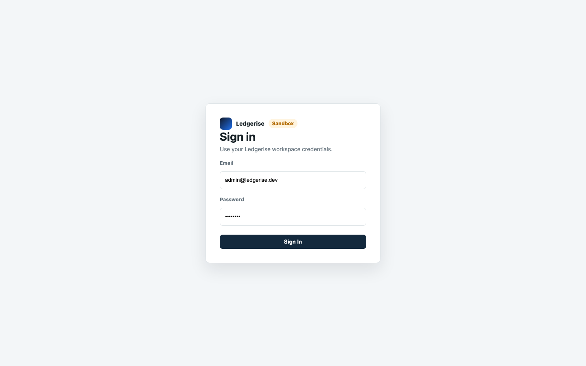
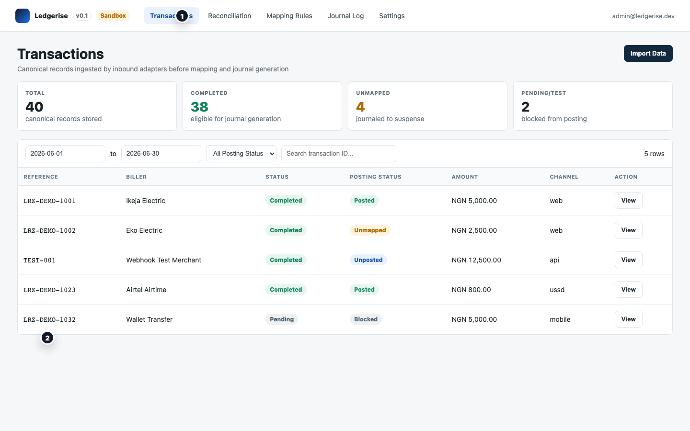

# first login

Once your Ledgerise deployment is running, sign in and confirm everything is working before you start configuration.

---

## open the dashboard

Navigate to your Ledgerise dashboard URL in a browser. If you deployed locally or have not yet set up a domain, try:

- Local Ledgerise proxy: `http://127.0.0.1:18080`
- Local health check: `http://127.0.0.1:18080/healthcheck`

If you deployed behind a reverse proxy or hosting panel, use your configured Ledgerise hostname, for example `https://ledgerise.your-domain.com`.

---

## sign in with the default credentials

Every fresh Ledgerise deployment creates a single default admin account on first startup. Sign in with:

- **Email:** `admin@ledgerise.dev`
- **Password:** `password`



After signing in, you should see the Ledgerise dashboard. Look for the **Sandbox** badge in the top navigation bar.



---

## what the sandbox badge means

The Sandbox badge tells you the deployment is in sandbox mode. In sandbox mode:

- Nothing you do affects your accounting system. Journal entries are generated but never posted.
- No commercial license is required.
- All transactions you import are treated as demo data.
- The default admin account (`admin@ledgerise.dev`) cannot be deleted or demoted.

Sandbox mode is the safe environment to finish your setup — configure adapters, import your chart of accounts, build mapping rules, and run test imports without any risk.

---

## what to do before going live

Use sandbox mode to complete the following before activating your commercial license:

1. **Connect your accounting system** — Settings → Adapters → configure the Zoho Books (or journal-csv) outbound adapter.
2. **Import your chart of accounts** — Settings → COA Reference → Import COA.
3. **Configure an inbound adapter** — Settings → Adapters → configure your webhook, CSV, or poll adapter.
4. **Build your mapping rules** — Mapping Rules → Add Rule. Create a rule for each product line and biller combination your platform handles.
5. **Import test transactions** — use the CSV adapter to upload a sample batch, or send a test webhook payload.
6. **Run the engine and check results** — Journal Log → Run Engine Now. Verify entries appear and resolve any unmapped transactions.
7. **Invite your team** — Settings → Users → Invite User. Add Finance Officers, Admins, and Auditors before going live. Do not rely solely on the default admin account in production.

→ Full guided walkthrough: [quickstart](../01-getting-started/04-quickstart.md)

---

## reset sandbox data before going live

When you are ready to go live, you will need to clear the demo data you accumulated during setup. Go to:

**Settings → System → Reset sandbox data**

This clears all demo transactions, journal entries, reconciliation runs, and related records. It does not touch your adapter configuration, mapping rules, or user accounts.

After resetting, activate your commercial license on the same screen.

→ Full checklist: [sandbox to production](05-sandbox-to-production.md)

---

## if you cannot sign in

**First login fails immediately:** Migrations may not have completed. Verify that you ran migrations before starting the API, then restart the API service:

```bash
docker compose --profile tools run --rm migrate
docker compose restart api
```

**The dashboard loads but shows "failed to fetch":** The web service may not be serving the correct `LEDGERISE_DOMAIN`, or your server proxy may not be forwarding the Ledgerise hostname to `127.0.0.1:18080`. Check `/runtime-config.js` on the dashboard domain and confirm it contains your Ledgerise hostname.

→ More troubleshooting: [docker deployment](02-docker-deployment.md#troubleshooting)
