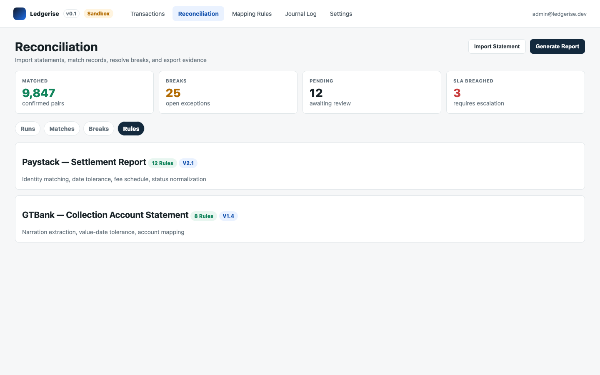
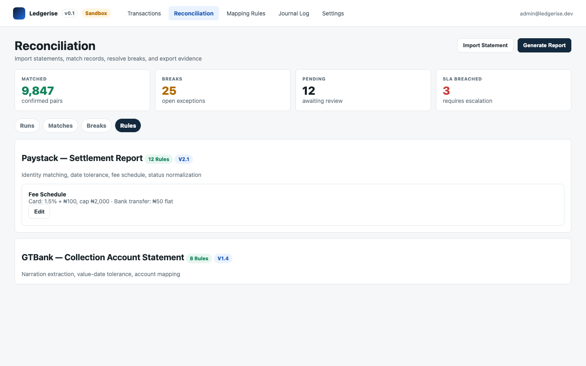
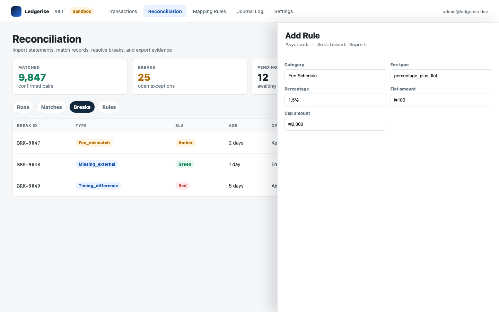
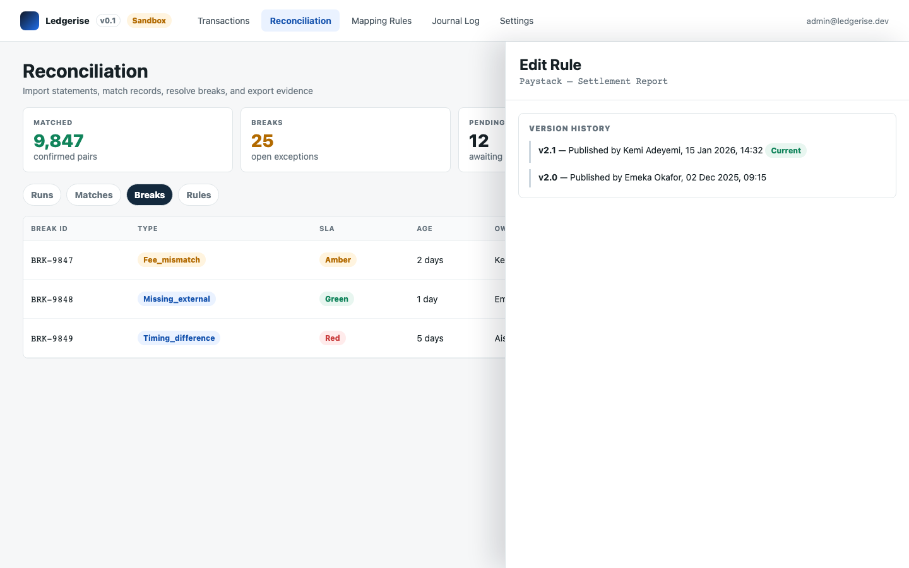

# reconciliation rules

Reconciliation rules are the configuration that tells the matching engine how to evaluate records from each counterparty. They control how internal and external references are paired, how amounts and fees are compared, what timing tolerances apply, and how breaks are escalated.

Rules are separate from the mapping rules on the Mapping Rules page. Reconciliation rules affect how transactions are verified; mapping rules affect how they are posted.

---

## where to find them

Go to **Reconciliation → Rules tab**. Rules are organised by report source — each counterparty and statement type has its own independent rule set. Within each report source, rules are grouped into nine categories.



---

## rule categories

Rules are executed in this sequence for every transaction case in a run:

| # | UI category label | What it controls |
|---|---|---|
| 1 | **Reference Matching** | How internal and external records are linked. At least one rule in this category is required per report source or the engine cannot match anything. |
| 2 | **Account Mapping** | Maps bank account numbers or merchant IDs to GL account codes. Used in bank statement matching to resolve which account a credit belongs to. |
| 3 | **Amount Tolerance** | Whether amounts must match exactly or within a band, and whether fee deductions are factored in before comparison. |
| 4 | **Fee Schedule** | The processor's fee structure — flat, percentage, or tiered — used to compute expected net settlement for each transaction. |
| 5 | **Timing** | The maximum settlement window between transaction date and external settlement date. |
| 6 | **Status Mapping** | How the processor's status codes map to Ledgerise canonical statuses — used to detect status mismatches. |
| 7 | **Direction Check** | Validates that debit/credit or inbound/outbound direction agrees on both sides of a matched pair. |
| 8 | **Duplicate Detection** | Time window and field combination for flagging duplicate internal or external records. |
| 9 | **Escalation** | SLA thresholds, auto-escalation delays, and auto-resolution conditions for specific break types. |

If Reference Matching produces no candidate pair for a record, a missing break is raised and the remaining categories are not evaluated for that record.

---

## reference matching

Reference Matching rules define how the engine establishes a candidate pair between an internal transaction and an external record. Rules are evaluated in priority order; the first rule that produces a confirmed pair stops further evaluation.

**Exact reference match** — joins internal and external records by comparing the reference field values exactly (case-insensitive by default). The most common starting point.

```
Internal source_id  ==  External processor_ref
```

**Prefix/suffix strip match** — strips a configured prefix or suffix from one or both sides before comparing. Use this when your processor truncates or decorates your reference IDs in their reports. For example, your internal ID `TXN-20260608-00123` may appear as `2026060800123` in the provider report.

**Fuzzy match** — applies similarity scoring when exact and strip matching fail. Links records where references are similar above a configured threshold (e.g. 80%), provided amount and date also hold. Every fuzzy match is surfaced in the Matches tab with its similarity score for review.

**Custom field match** — links records on a non-standard field combination. Use when a processor uses an order ID, invoice number, or session ID rather than a transaction reference as their primary key. Supports dot notation into transaction `metadata` for non-canonical fields.

> **Start with Exact.** Most integrations work with an exact reference match once you have identified the correct internal and external columns. Add strip or fuzzy rules only when you observe consistent reference format differences after your first few runs.

---

## amount tolerance

Amount Tolerance rules validate that the amounts on a candidate pair are consistent. Options:

**Exact amount match** — internal and external gross amounts must be identical. No variance permitted.

**Absolute tolerance** — permits a configured absolute difference. For example, ±₦50 on any transaction. Differences within the band are confirmed with confidence `tolerance_approved` and logged. Differences beyond the band raise an `amount_mismatch` break.

**Percentage tolerance** — permits a configured percentage difference. For example, ±0.5% of the internal amount.

**Net amount after fee** — computes expected net from the internal gross minus your configured fee schedule, then compares against the external net settlement. This is the correct rule for provider report matching where fees are deducted before settlement:

```
expected_net = internal_gross - fee_schedule_computed_fee
match = |expected_net - external_net| <= tolerance
```

**Batch total** — aggregates internal net amounts for a group of transactions and compares the total against a single external credit. Used in bank statement reconciliation where one bank credit covers multiple settled transactions.

---

## fee schedule

The fee schedule is the reference object used by Amount Tolerance and Fee Schedule rules. It defines your processor's fee structure — how much they deduct from each transaction before settling to you.

Each saved report source has one active fee schedule at a time. Configure it in the **Fee Schedule** category section on the Rules tab.

**Fee type options:**

| Type | How the fee is computed |
|---|---|
| `percentage` | `amount × percentage ÷ 100` |
| `flat` | A fixed amount per transaction, regardless of size |
| `percentage_plus_flat` | `(amount × percentage ÷ 100) + flat_amount` |
| `tiered` | Fee varies by amount band — configured as a series of bands |

**Fee cap** — if set, the computed fee is capped at this value. Common for processors like Paystack where card fees are capped at ₦2,000.

**VAT on fee** — if your processor charges VAT on top of the base fee, enable this. VAT is computed on the base fee and included in the total deducted.

**Multiple tiers** — you can configure different fee structures per transaction type within the same schedule. For example, Paystack charges 1.5% + ₦100 capped at ₦2,000 for card transactions, and a flat ₦50 for bank transfers.

When a fee mismatch break is resolved with `fee_schedule_updated`, update the fee schedule here so future runs automatically compute the correct expected net.

Adding a new fee schedule version does not delete the old one. The old schedule retains its `effective_to` date, and the engine uses the schedule version that was active on the transaction's `occurred_at` date. This ensures historical match computations remain reproducible even after a schedule change.



---

## timing

Timing rules define the settlement window — the maximum number of business days between the transaction date and the external settlement date. Transactions settling outside this window raise a `timing_difference` break.

Key settings:

- **Settlement window** — maximum business days from transaction date to external value date. Example: 2 business days.
- **Holiday calendar** — the public holiday calendar used when computing business days. `nigeria_cbn` is the default.
- **Cutoff time** — transactions occurring after this time (e.g. 22:00 WAT) are expected to settle the following business day. Prevents false timing breaks on end-of-day transactions.

For counterparties with known late settlement patterns (e.g. a provider that consistently settles 4 business days after the transaction), you can configure an auto-resolve timing rule under the Escalation category to automatically close timing breaks within an extended window.

---

## escalation

Escalation rules control SLA thresholds and automatic escalation behaviour:

- **SLA thresholds per break type** — how many business days before a break is considered breached.
- **Auto-escalation** — how many days beyond the SLA threshold before a break is automatically escalated to a senior reviewer.
- **Auto-resolve conditions** — specific break types and conditions that can be closed automatically without Finance Officer intervention. Every auto-resolution creates an audit log entry.

Common auto-resolve rules:

- **Tolerance auto-close** — automatically closes `amount_mismatch` or `fee_mismatch` breaks where the difference is within a configured minimum threshold (e.g. differences under ₦10 are write-offs with no value).
- **Extended timing window** — automatically closes `timing_difference` breaks that fall within a wider secondary window for counterparties with known but consistent late settlement.
- **Zero-value duplicate suppression** — automatically suppresses external duplicate records where the duplicated entry has a zero net amount (a common reporting artefact).

> Auto-resolution is never silent. Every auto-resolved break creates an audit entry with the rule that triggered it, the computed values, and the resolution type applied.

---

## creating and editing rules

1. On the Rules tab, find the report source and category you want to add a rule to.
2. Click **+ Add** to create a new rule, or **Edit** on an existing rule card.
3. Fill in the rule name, description, and category-specific fields.
4. Click **Save Draft** to save without activating — the rule is stored but not applied by the engine. This is useful when you want to review a rule before it affects the next run.
5. Click **Publish** when the rule is ready. A new version is created and the rule becomes active.



---

## rule versions and audit trail

Every published change to a rule creates a new version. The version badge on each rule card (e.g. `v2.1`) shows the current version at a glance.

Click **Edit** on any rule card and expand the **Version History** section at the bottom of the drawer to see a full timeline of all published versions — who changed it, when, and what changed. This history is immutable and forms part of the reconciliation audit trail.

Reconciliation runs always record which rule versions were active at the time the run was executed. If a rule changes after a run, the original run's results are unaffected and remain reproducible.



---

## access control for rules

| Role | What they can do |
|---|---|
| Admin | Create, edit, publish, and deactivate all rules and fee schedules |
| Finance | Create, edit, publish, and deactivate all rules and fee schedules |
| Auditor | View rules and version history only — no modifications |
