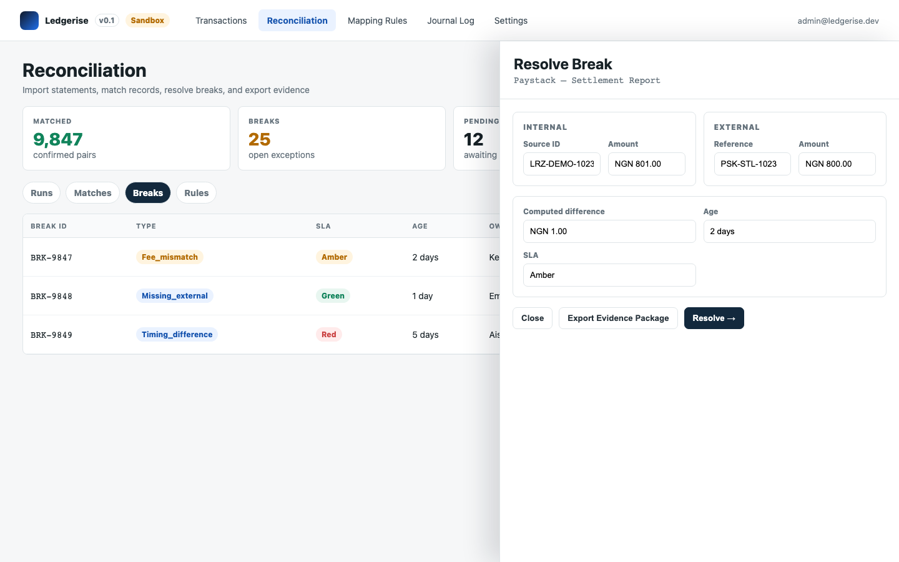
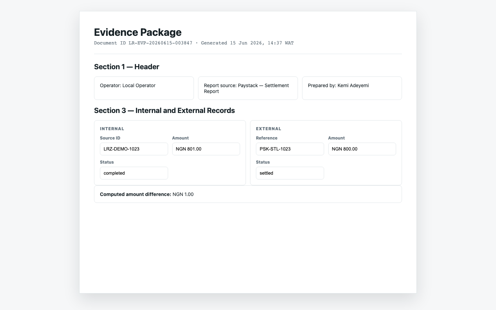

# evidence packages

An evidence package is a single timestamped document that captures the complete record for one transaction or break. It is designed to be shared with auditors, partner banks, or regulators — everything they need to understand a specific transaction or discrepancy in one self-contained file.

---

## what an evidence package contains

An evidence package is generated per break or per match. Its contents vary slightly depending on the type, but always include:

- **Canonical transaction record** — the full internal record: source ID, amount, currency, product line, biller, status, timestamps, source adapter, and source environment.
- **External record snapshot** — the counterparty's record as it appeared at the time the break was raised or the match was confirmed.
- **Break or match classification** — the type of discrepancy (or the match confidence level), both sides of the evidence, and the computed difference.
- **All resolution attempts** — who took action, when, what resolution type was selected, and the resolution note. If the break was escalated before being resolved, that history is included.
- **Match confidence and method** — for matched records, which field(s) were used to confirm the pair and at what confidence level.
- **Reconciliation run metadata** — the run ID, report source, date range, imported by, and completed at timestamp.
- **Relevant audit log entries** — all reconciliation events related to this transaction from `recon_audit_log`.

The document is stamped with a generation timestamp and a document ID. It cannot be altered after generation.

---

## where to generate an evidence package

The **Export Evidence Package** button appears in the detail drawer for:

- **A break record** — Reconciliation → Breaks → click any row → Export Evidence Package (in the Step 1 footer, between Close and Resolve).
- **A match record** — Reconciliation → Matches → click any row → Export Evidence Package.
- **A transaction** — Transactions page → click any row → Export Evidence Package (in the transaction detail drawer footer).

---

## what the output looks like

Evidence packages open in the report viewer at `reports.html` and render as a paginated PDF-style document. The toolbar has three actions: **Back**, **Print**, and **Download PDF**.

The document has eight sections:

1. **Header** — Document ID, generated at timestamp, operator name
2. **Transaction summary** — key canonical fields from the internal record
3. **Match or break result** — classification, confidence, both sides of the evidence side by side
4. **Reconciliation run metadata** — which run produced this result
5. **Amount comparison table** — internal amount, external amount, fee computed, fee charged, net expected, net received, and variance
6. **Status timeline** — the lifecycle of this reconciliation case from `imported` to its current or final status
7. **Notes and evidence** — all resolution notes, manual match notes, escalation notes, and any attached reference documents
8. **Footer** — digital signature block with document ID and generation timestamp

---

## typical uses

**Regulatory submission** — a CBN or FCCPC enquiry about a specific transaction. The evidence package provides the full transaction record, its reconciliation status, the external counterparty evidence, and the resolution audit trail in one document.

**Partner bank dispute** — your bank questions a credit or a debit on your settlement account. The evidence package for the corresponding break or match provides both sides of the evidence and the resolution decision.

**Internal audit** — an auditor reviewing your reconciliation process for a specific period. Evidence packages for all breaks in that period give the auditor a full picture of what was disputed, how it was investigated, and who made each resolution decision.

**Chargeback documentation** — when a `missing_internal` break is resolved as `chargeback_acknowledged`, the evidence package captures the chargeback reference, the resolution, and the audit trail — ready for submission to your acquiring bank.

---

## evidence packages vs reconciliation reports

These are two distinct document types:

| | Evidence package | Reconciliation report |
|---|---|---|
| Scope | One specific break or match | One run or period |
| Generated from | Break or match detail drawer | Generate Report button |
| Format | PDF (always) | PDF + CSV (always both) |
| Use | Regulatory, dispute, audit — for a specific transaction | Management reporting, compliance, audit — for a period |
| Bulk generation | No — always per break or per match | Yes — covers all matches and breaks in scope |

Generate evidence packages when you need to document a specific transaction or break. Generate reconciliation reports when you need to document a reconciliation period or run.
