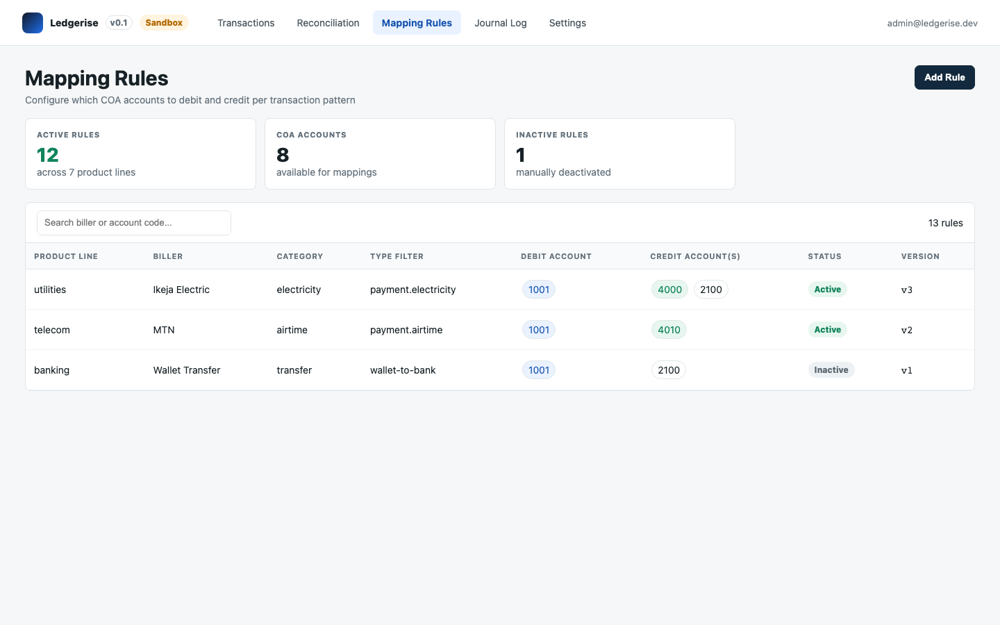

# mapping rules overview

Mapping rules are the configuration that tells the journal engine which accounts to debit and credit for a given transaction. They are how your finance team's accounting knowledge gets encoded into Ledgerise — without writing any code.

---

## what mapping rules are

A mapping rule is a configuration record that matches transactions on a combination of **product line**, **biller**, **biller category**, and an optional **transaction type filter**, and tells the journal engine which chart of accounts (COA) entries to debit and credit when it finds a match.

Ledgerise does not know your accounting structure. Your finance team knows that airtime payments should credit one revenue account and electricity payments should credit another. Mapping rules are how you give the engine that knowledge.

No code changes are required. Finance Officers and Admins create, edit, activate, and deactivate rules entirely through the Mapping Rules page.

---

## the mapping rules page

The page has three parts:

**Stat bar** — three counts at a glance: **Active Rules**, **Inactive**, and **Unmapped Today**. A non-zero "Unmapped Today" count means transactions arrived that did not match any rule and were posted to the suspense account instead.

**Filter bar** — filter the rules table by product line, status, or a free-text search.

**Rules table** — one row per rule, showing product line, biller, biller category, type filter, debit account, credit account(s), status, version, and last match.

---

## reading account codes at a glance

Account code chips are colour-coded by account class, so you can read what a rule does without memorising codes:

| Colour | Account class |
|---|---|
| Blue | Asset |
| Amber | Liability |
| Green | Income |
| Red | Expense |
| Purple | Suspense |

---

## who can manage mapping rules

| Role | Access |
|---|---|
| Admin | Full — create, edit, activate, deactivate |
| Finance | Full — create, edit, activate, deactivate |
| Auditor | No access. Mapping Rules is not visible to the Auditor role. |

This is a stricter restriction than most other pages in Ledgerise, where Auditors typically get read-only access. Mapping rules determine where money lands in your books, so visibility is limited to the roles responsible for configuring them.

---

## rules don't always mean instant posting

Matching a mapping rule determines *which accounts* a transaction posts to — it does not by itself guarantee the transaction posts immediately. If your deployment has a reconciliation **posting gate** configured (Settings → System), the engine may hold a matched transaction until it clears reconciliation, even though a rule has already resolved its debit and credit accounts. By default the posting gate is `disabled`, so in most deployments a matched rule does lead to posting on the next engine run.

→ See [how Ledgerise works](../01-getting-started/02-how-ledgerise-works.md) for the full data flow

---

## how many rules do you need?

This varies by operator, but for a mature fintech handling several product lines and dozens of billers, 50–100 rules is a typical steady state. Most of that work happens once, during initial setup — ongoing maintenance is usually a handful of new rules per month as you add billers or product lines.

---

## where to go next

- [Creating a rule](02-creating-a-rule.md) — step-by-step instructions for adding your first rules
- [Rule resolution order](03-rule-resolution-order.md) — how the engine picks a rule when more than one could match
- [Chart of accounts](04-chart-of-accounts.md) — where the debit and credit accounts in your rules come from
- [Rule audit trail](05-rule-audit-trail.md) — how every change to a rule is tracked
