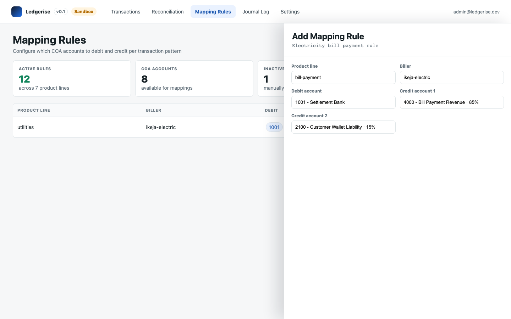
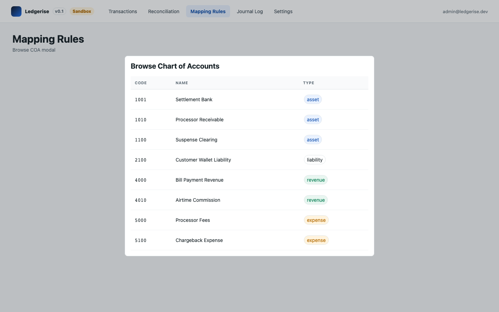
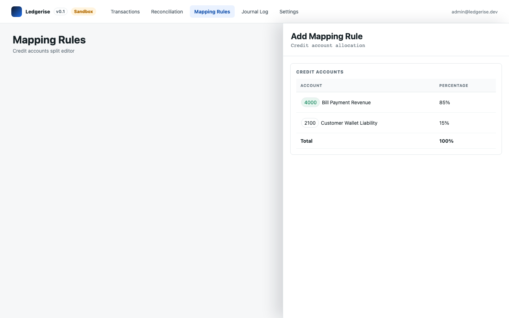

# creating a rule

This page walks through creating a mapping rule, field by field.

---

## before you start

Have the following ready:

- The **product line** the rule applies to (for example, `bill-payment`, `wallet`, `agency`).
- The **biller** or **biller category**, if you are creating a rule more specific than a product-line catch-all.
- The **debit and credit account codes** from your chart of accounts. → See [chart of accounts](04-chart-of-accounts.md) if you have not imported your COA yet.

---

## open the add rule drawer

1. Go to **Mapping Rules**.
2. Click **Add Rule** in the page header.

The drawer opens on the right. The rules table stays visible behind it, so you can check existing rules while configuring the new one.

---

## fill in the fields

| Field | Required | Notes |
|---|---|---|
| Product line | Yes | The operator's product line. This is the primary matching key. |
| Biller | No | The exact biller identifier (for example, `ikeja-electric`). When set, this is the highest-priority match. |
| Biller category | No | A broader grouping (for example, `electricity`). Used when no exact biller match exists. |
| Transaction type filter | No | Multi-select from the standard transaction type taxonomy. Leave empty to match all transaction types on the matched product line. |
| Debit account | Yes | A single account, chosen from a searchable COA picker. |
| Credit accounts | Yes | One or more accounts, each with a percentage. Click **+ Add** to add another row. Percentages across all rows must sum to 100. |
| Description | No | A plain-English note about what this rule covers — useful context for teammates and auditors. |
| Status | Yes | **Active** or **Inactive**. The engine only evaluates active rules. |

Click **Browse COA** at any account field to open a modal showing your full chart of accounts with colour-coded type chips, if you need to look up a code rather than search for it.

---

## splitting credit accounts

Use more than one credit account when revenue needs to be divided — for example, 80% to your revenue account and 20% to a partner settlement account. Add a row for each account and set its percentage. Ledgerise will not let you save the rule unless the percentages sum to exactly 100.

---

## save the rule

Click **Save**. The rule is evaluated starting on the next engine run — it does not retroactively reprocess transactions that already posted or were marked unmapped before the rule existed.

---

## activating and deactivating rules

Use the status toggle on the rules table or inside the rule's detail drawer.

- **Deactivating** a rule shows a confirmation with the estimated number of transactions matched by this rule in the last 24 hours. Those transactions will go to suspense once the rule is inactive, so review the estimate before confirming.
- **Activating** a rule confirms immediately, with no count shown.

> Deactivating a rule does not affect journal entries that have already posted under it. Those entries keep their original mapping rule version on record.

---

## when to create a new rule

Check the **Unmapped Today** stat on the Mapping Rules page. If it is non-zero, go to **Transactions**, find an unmapped transaction, and click **Assign Rule** — this opens the Add Rule drawer pre-filtered to that transaction's product line, so you can create the missing rule without losing context.

→ Full instructions: [unmapped transactions](../03-transactions/07-unmapped-transactions.md)

---

## next steps

- [Rule resolution order](03-rule-resolution-order.md) — understand which rule wins when more than one could match a transaction
- [Rule audit trail](05-rule-audit-trail.md) — see how every change to this rule is tracked
