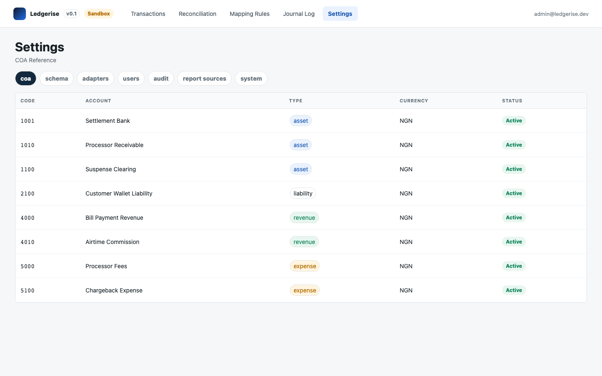

# chart of accounts

Ledgerise needs to know your chart of accounts (COA) so your finance team can pick the right accounts when building mapping rules. This page explains where that COA comes from and how to keep it current.

---

## the COA is read-only in Ledgerise

Ledgerise does not own or manage your chart of accounts. It imports a read-only copy from your connected accounting system — Zoho Books, or QuickBooks when supported — and uses it purely as a reference when your finance team configures mapping rules.

You manage your COA in your accounting system, not in Ledgerise. Add, rename, or retire accounts there. Ledgerise reflects whatever exists in your accounting system at the time you last imported it.

---

## where to view it

Go to **Settings → COA Reference**. The page lists every account in your imported COA with its code, name, account type (shown with a colour chip), and currency.

---

## importing your COA

1. Go to **Settings → COA Reference**.
2. Click **Import COA**.
3. Ledgerise pulls your current account list from the connected accounting system. The page shows a "last imported" timestamp once the import completes.

Re-import whenever you add, rename, or retire an account in your accounting system. Ledgerise does not pick up those changes automatically — there is no live sync, only an on-demand pull.

If you are using the `journal-csv` adapter and have no direct accounting system connection, you can skip this and enter account codes manually when creating mapping rules.

---

## using the COA in mapping rules

The debit and credit account fields in the Add/Edit Rule drawer are searchable — type an account name or code to find it. If you'd rather browse the full list, click **Browse COA** to open a modal showing every account with its colour-coded type chip.

→ See [creating a rule](02-creating-a-rule.md)

---

## if an account is missing

If an account you expect to use in a mapping rule doesn't appear in the COA Reference list, it most likely doesn't exist yet in your accounting system, or it was added after your last import. Add or confirm it in Zoho Books (or your accounting system) first, then re-import in Ledgerise.
