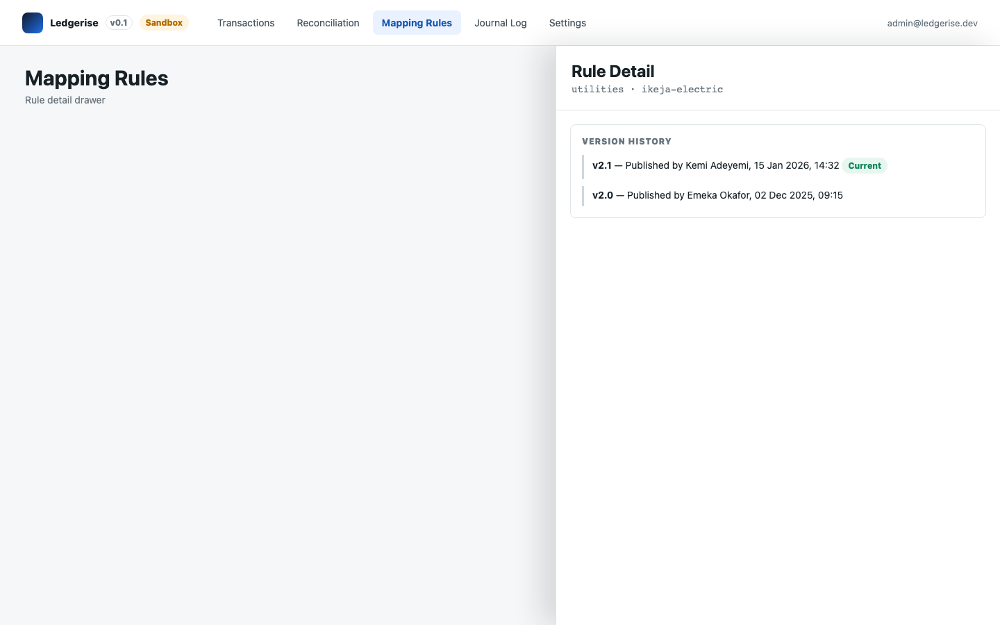

# rule audit trail

Every change to a mapping rule is recorded automatically. This page explains what gets tracked and where to find it.

---

## what gets recorded

Creating, editing, activating, or deactivating a mapping rule produces a new immutable version. Each version records:

- The version number
- The effective-from date
- The user who made the change
- The full before-and-after state of the rule

This happens automatically — there is no separate step to "enable" auditing on a rule.

---

## where to view it

1. Go to **Mapping Rules**.
2. Click a rule row to open its detail drawer.
3. Expand the **Version History** section.

You'll see a timeline of every version the rule has ever had, most recent first, with the user attribution and change date for each.

---

## why this matters

When an auditor or your finance team asks why a particular journal entry debited one account and not another, the version history gives you the answer: which rule version was active on the date that entry was posted, and exactly what it specified.

Journal entries themselves also carry this link forward. Open any entry in the **Journal Log** and its detail drawer shows **Mapping rule version applied** — the exact version active when that entry was generated, even if the rule has since been edited.

→ See [rule resolution order](03-rule-resolution-order.md#seeing-which-rule-was-applied) for how to look this up from the Journal Log side

---

## immutability

The audit trail is append-only. Past versions cannot be edited or deleted through the UI or the API — not even by an Admin. Editing a rule always creates a new version; it never rewrites history.

---

## who can see this

Version history is part of the Mapping Rules page, so it follows the same access rule: Admins and Finance users can view it. The Auditor role has no access to Mapping Rules at all, so auditors reviewing rule history will need an Admin or Finance Officer to pull it for them, or to review it together.
