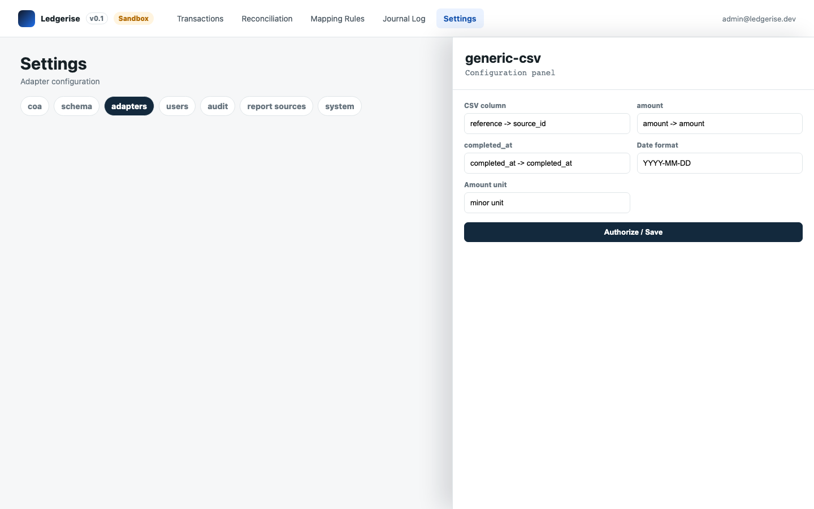

# generic CSV import adapter

The `csv-import` adapter lets you upload transaction data as a flat file. It supports CSV and XLSX formats and saves your column mapping so repeated imports from the same source are fast.

---

## when to use this adapter

Use the CSV import adapter when:

- Your transaction source exports batch files (daily, weekly, or on demand).
- You are migrating historical data into Ledgerise.
- You are running a one-off test import before setting up a webhook or poll integration.
- Your source system has no API and no webhook capability.

For live, real-time transaction ingestion, prefer the webhook or poll adapter.

---

## supported file formats

| Format | Extension |
|---|---|
| Comma-separated values | `.csv` |
| Excel workbook | `.xlsx` |

Tab-separated and semicolon-delimited files are also accepted as CSV variants — specify the delimiter in the configuration.

---

## configuration

Go to **Settings → Adapters → csv-import → Configure**.

| Field | Required | Description |
|---|---|---|
| Column mapping | Yes | Maps canonical schema fields to column names or indices in the file |
| Date format | Yes | The format your file uses for date/time fields (for example, `YYYY-MM-DD` or `DD/MM/YYYY HH:mm:ss`) |
| Amount format | Yes | Whether amounts are in full currency units (for example, 500.00 NGN) or smallest units (50000 kobo) |
| Delimiter | No | Column delimiter character. Defaults to comma for CSV. |
| Header row | No | Whether the first row is a header row. Defaults to yes. |

---

## the import flow

1. Go to **Settings → Adapters → csv-import** and click **Upload File**.
2. Select your file. A preview of the first few rows appears.
3. Map each canonical field to the column in your file that contains it. If a column mapping was saved from a previous import from the same source, it is pre-filled.
4. Confirm the date format and amount format.
5. Click **Import**. Ledgerise processes the file and the records appear in the Transactions page.

→ Full step-by-step: [importing transactions](../03-transactions/04-csv-import.md)

---

## saved column mappings

After a successful import, Ledgerise saves the column mapping under the source filename pattern. The next time you upload a file with the same name pattern, the mapping is pre-filled. Review the mapping before confirming — saved mappings do not update automatically if the source file format changes.

---

## what happens to each row

Each row in the file becomes one transaction record. Rows that fail validation (missing required fields, unparseable dates, zero amounts) are flagged individually and reported after the import. Valid rows are processed normally. An import with some invalid rows is not aborted — valid rows are imported and invalid rows are listed in an error summary.

---

## limitations

- No real-time ingestion. Import is a manual, on-demand action.
- Maximum recommended file size: check your deployment's configured upload limit. Very large files (over 50,000 rows) may time out — split them into smaller batches.
- No automatic deduplication within a single file. If the same `source_id` appears in two rows, the second one is skipped by the engine's deduplication at posting time (not at import time).
