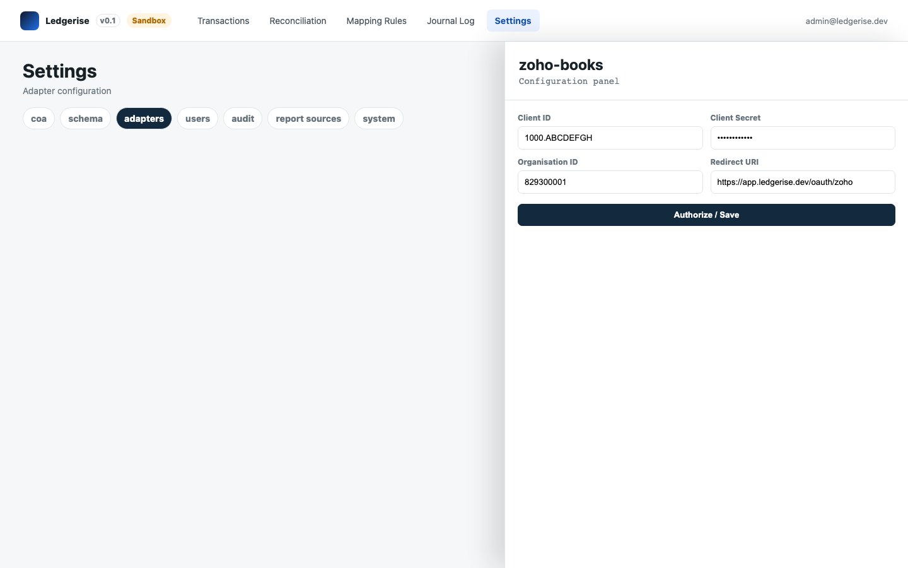

# zoho books adapter

The `zoho-books` outbound adapter posts Ledgerise journal entries to Zoho Books as manual journal records. It handles authentication, batching, and rate limiting automatically.

---

## prerequisites

Before configuring this adapter, you need:

- A Zoho Books account with at least one active organisation.
- An OAuth 2.0 application configured in the [Zoho Developer Console](https://api-console.zoho.com/). You will need the **Client ID** and **Client Secret** from this application.
- Your Zoho Books **Organisation ID** — found in Zoho Books → Settings → Organisation Profile, or in the URL when you are logged into your organisation.
- Your chart of accounts imported into Ledgerise. Account codes in Ledgerise must match account names or codes in Zoho Books exactly. → See [chart of accounts](../05-mapping-rules/04-chart-of-accounts.md)

---

## configuration

1. Go to **Settings → Adapters → zoho-books → Configure**.
2. Enter your **Client ID**, **Client Secret**, and **Organisation ID**.
3. Click **Authorize**. Ledgerise opens the Zoho OAuth consent screen. Sign in to Zoho and grant access.
4. After authorisation, Ledgerise stores the access and refresh tokens. The healthcheck status updates to green.

---

## OAuth flow details

Ledgerise uses the Zoho Books OAuth 2.0 authorization code flow. After you complete the consent screen once, Ledgerise stores a refresh token and handles token renewal automatically. You do not need to re-authorise after the initial setup unless you revoke the application's access in Zoho or rotate your credentials.

If the adapter shows `AUTH_FAILED` after previously working, the refresh token may have expired or been revoked. Re-enter your credentials and re-authorise.

---

## how Ledgerise maps entries to Zoho Books

Each Ledgerise journal entry becomes one **manual journal record** in Zoho Books. The mapping is:

| Ledgerise field | Zoho Books field |
|---|---|
| Journal ID | Reference number |
| Entry date | Journal date |
| Debit lines | Debit entries (account, amount) |
| Credit lines | Credit entries (account, amount) |
| Transaction ID | Notes / narration |

Account codes in Ledgerise mapping rules must match account names or codes exactly as they appear in Zoho Books. A mismatch produces an `Invalid account code` error on posting. → See [retrying failed entries](../06-journal-log/03-retrying-failed-entries.md#common-errors-and-fixes)

---

## rate limits

Zoho Books allows 100 API calls per minute per organisation. Ledgerise batches journal entries and manages rate limiting automatically — if the limit is reached, Ledgerise backs off and retries without any action required from you.

On very high volume days (several thousand new transactions per engine run), you may see the engine run complete but some entries post in a subsequent run as the backlog clears within the rate limit. This is expected behavior.

---

## troubleshooting

**AUTH_FAILED**

The Zoho access token has expired or been revoked. Go to **Settings → Adapters → zoho-books → Configure**, re-enter your Client ID and Client Secret, and click **Authorize** to complete the OAuth flow again.

**Invalid account code**

A mapping rule references a COA account code that doesn't exist in Zoho Books. Either the account was deleted in Zoho, or the code in the mapping rule doesn't match the Zoho account name exactly.

Fix: confirm the account exists in Zoho Books → Chart of Accounts. Then go to **Settings → COA Reference → Import COA** to refresh the account list in Ledgerise. Update the affected mapping rule with the correct account. Retry the failed entries.

**RATE_LIMITED**

Ledgerise is hitting Zoho's 100-calls-per-minute limit. This is usually transient and the automatic retry schedule handles it. If you see persistent rate limit errors over multiple engine runs, check whether another integration is also using the same Zoho Books API application and consuming part of the limit.
